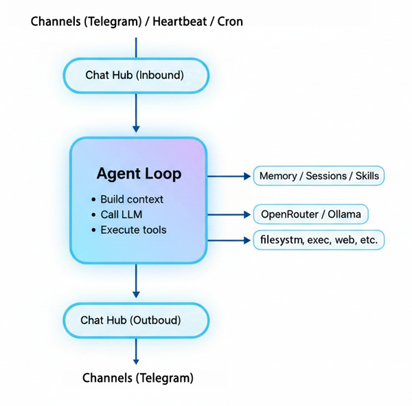

<p align="center">
  
  <h1 align="center">Picobot</h1>
  <p align="center"><strong>The AI agent that runs anywhere — even on a $5 VPS.</strong></p>
  <p align="center">
    
    
    
    
    
    
  </p>
</p>

---

Love the idea of open-source AI agents like [OpenClaw](https://github.com/openclaw/openclaw) but tired of the bloat? **Picobot** gives you the same power — persistent memory, tool calling, skills, Telegram and Discord integration — in a single ~10MB binary that boots in milliseconds.

No Python. No Node. No 500MB container. Just one Go binary and a config file.

## Why Picobot?

| | Picobot | Typical Agent Frameworks |
|---|---|---|
| **Binary size** | ~10MB | 200MB+ (Python + deps) |
| **Docker image** | ~28MB (Alpine) | 500MB–1GB+ |
| **Cold start** | Instant | 5–30 seconds |
| **RAM usage** | ~10MB idle | 200MB–1GB |
| **Dependencies** | Zero (single binary) | Python, pip, venv, Node… |

Picobot runs happily on a **$5/mo VPS**, a Raspberry Pi, or even an old Android phone via Termux.

## Quick Start — 30 seconds

### Docker Run

```sh
docker run -d --name picobot \
  -e OPENAI_API_KEY="your-key" \
  -e OPENAI_API_BASE="https://openrouter.ai/api/v1" \
  -e PICOBOT_MODEL="openrouter/free" \
  -e TELEGRAM_BOT_TOKEN="your-telegram-token" \
  -v ./picobot-data:/home/picobot/.picobot \
  --restart unless-stopped \
  louisho5/picobot:latest
```

All config, memory, and skills are persisted in `./picobot-data` on your host.

### Docker Compose

Create a `docker-compose.yml`:

```yaml
services:
  picobot:
    image: louisho5/picobot:latest
    container_name: picobot
    restart: unless-stopped
    environment:
      - OPENAI_API_KEY=your-key
      - OPENAI_API_BASE=https://openrouter.ai/api/v1
      - PICOBOT_MODEL=openrouter/free
      - TELEGRAM_BOT_TOKEN=your-telegram-token
      - TELEGRAM_ALLOW_FROM=your-user-id
    volumes:
      - ./picobot-data:/home/picobot/.picobot
```

Then run:

```sh
docker compose up -d
```

### From Source

```sh
go build -o picobot ./cmd/picobot
./picobot onboard                     # creates ~/.picobot config + workspace
./picobot agent -m "Hello!"           # single-shot query
./picobot gateway                     # long-running mode with Telegram
```

## Architecture

Actually the logic is simple and straightforward. Messages flow through a **Chat Hub** (inbound/outbound channels) into the **Agent Loop**, which builds context from memory/sessions/skills, calls the LLM via OpenAI-compatible API, and executes tools (filesystem, exec, web, etc.) before sending replies back through the hub.

<p>
  
</p>

Notes: Channel refers to communication channels (e.g., Telegram, Discord, WhatsApp, etc.).

## Features

### 11 Built-in Tools

The agent can take real actions — not just chat:

| Tool | What it does |
|------|-------------|
| `filesystem` | Read, write, list files |
| `exec` | Run shell commands |
| `web` | Fetch web pages and APIs |
| `message` | Send messages to channels |
| `spawn` | Launch background subagents |
| `cron` | Schedule recurring tasks |
| `write_memory` | Persist information across sessions |
| `create_skill` | Create reusable skill packages |
| `list_skills` | List available skills |
| `read_skill` | Read a skill's content |
| `delete_skill` | Remove a skill |

### Persistent Memory

Picobot remembers things between conversations:

- **Daily notes** — auto-organized by date
- **Long-term memory** — survives restarts
- **Ranked recall** — retrieves the most relevant memories for each query

```sh
picobot memory recent --days 7     # what happened this week?
picobot memory rank -q "meeting"   # find relevant memories
```

### Skills System

Teach your agent new tricks. Skills are modular knowledge packages that extend the agent:

```sh
You: "Create a skill for checking weather using curl wttr.in"
Agent: Created skill "weather" — I'll use it from now on.
```

Skills are just markdown files in `~/.picobot/workspace/skills/`. Create them via the agent or manually.

### Telegram Integration

Chat with your agent from your phone. Set up in 2 minutes:

1. Message [@BotFather](https://t.me/BotFather) — `/newbot` — copy the token
2. Add the token to config or pass as `TELEGRAM_BOT_TOKEN` env var
3. Start the communication gateway

See [HOW_TO_START.md](HOW_TO_START.md) for a detailed BotFather walkthrough.

### Discord Integration

Connect your agent to Discord servers:

1. Go to [Discord Developer Portal](https://discord.com/developers/applications)
2. Create a new application and bot
3. Enable **Message Content Intent** in Bot settings
4. Copy the bot token
5. Add to config under `channels.discord` in your `config.json`

The bot will respond when mentioned in servers, or to all messages in DMs.

See [HOW_TO_START.md](HOW_TO_START.md) for a detailed Discord Bot walkthrough.

### Heartbeat

A configurable periodic check (default: 60s) that reads `HEARTBEAT.md` for scheduled tasks — like a personal cron with natural language.

## Configuration

Picobot uses a single JSON config at `~/.picobot/config.json`:

```json
{
  "agents": {
    "defaults": {
      "model": "google/gemini-2.5-flash",
      "maxTokens": 8192,
      "temperature": 0.7,
      "maxToolIterations": 200
    }
  },
  "providers": {
    "openai": {
      "apiKey": "sk-or-v1-YOUR_KEY",
      "apiBase": "https://openrouter.ai/api/v1"
    }
  },
  "channels": {
    "telegram": {
      "enabled": true,
      "token": "YOUR_TELEGRAM_BOT_TOKEN",
      "allowFrom": ["YOUR_TELEGRAM_USER_ID"]
    },
    "discord": {
      "enabled": true,
      "token": "YOUR_DISCORD_BOT_TOKEN",
      "allowFrom": ["YOUR_DISCORD_USER_ID"]
    }
  }
}
```

Supports any **OpenAI-compatible API** (OpenAI, OpenRouter, Ollama, etc.). See [CONFIG.md](CONFIG.md) for more details.

## CLI Reference

```
picobot version                        # print version
picobot onboard                        # create config + workspace
picobot agent -m "..."                 # one-shot query
picobot agent -M model -m "..."        # query with specific model
picobot gateway                        # start long-running agent
picobot memory read today|long         # read memory
picobot memory append today|long -c "" # append to memory
picobot memory write long -c ""        # overwrite long-term memory
picobot memory recent --days N         # recent N days
picobot memory rank -q "query"         # semantic memory search
```

## Run on Minimal Hardware

Picobot was designed for constrained environments:

```sh
# Raspberry Pi / ARM device
GOARCH=arm64 CGO_ENABLED=0 go build -ldflags="-s -w" -o picobot ./cmd/picobot

# Old x86 VPS
GOARCH=amd64 CGO_ENABLED=0 go build -ldflags="-s -w" -o picobot ./cmd/picobot
```

Works on any Linux with 256MB RAM. No runtime dependencies. Just copy the binary and run.

## Tech Stack

| Layer | Technology |
|-------|------------|
| Language | [Go](https://go.dev/) 1.26+ |
| CLI framework | [Cobra](https://github.com/spf13/cobra) |
| LLM providers | OpenAI-compatible API (OpenAI, OpenRouter, Ollama, etc.) |
| Telegram | Raw Bot API (no third-party SDK, standard library `net/http`) |
| Discord | [discordgo](https://github.com/bwmarrin/discordgo) library |
| HTTP / JSON | Go standard library only (`net/http`, `encoding/json`) |
| Container | Alpine Linux 3.20 (multi-stage Docker build) |

Picobot has **two** external dependencies (`spf13/cobra` for CLI parsing, `bwmarrin/discordgo` for Discord). Everything else — HTTP clients, JSON handling, Telegram polling, provider integrations — uses the Go standard library.

## Project Structure

```
cmd/picobot/          CLI entry point
embeds/               Embedded assets (sample skills)
internal/
  agent/              Agent loop, context, tools, skills
  chat/               Chat message hub
  channels/           Telegram, Discord
  config/             Config schema, loader, onboarding
  cron/               Cron scheduler
  heartbeat/          Periodic task checker
  memory/             Memory read/write/rank
  providers/          OpenAI-compatible provider
  session/            Session manager
docker/               Dockerfile, compose, entrypoint
```

## Roadmap

- [x] Add Telegram support
- [x] Add Discord support
- [ ] Add WhatsApp support
- [x] AI agent with skill creation capability
- [ ] Integrate with MCP Servers
- [ ] Integrate additional useful default skills
- [ ] Add more tools (email, file processing, etc.)

Want to contribute? Open an issue or PR with your ideas!

## Docs

- [HOW_TO_START.md](HOW_TO_START.md) — step-by-step getting started guide
- [CONFIG.md](CONFIG.md) — full configuration reference
- [DEVELOPMENT.md](DEVELOPMENT.md) — development, testing, and Docker publishing
- [docker/README.md](docker/README.md) — Docker deployment guide

## License

MIT — use it however you want.
